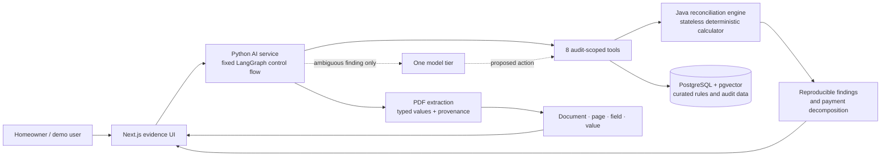

# ServicerSwitch

## Measured results

| Metric | System | Naive baseline |
|---|---:|---:|
| Document classification, held-out family | 100.00% | n/a |
| Field extraction, in-distribution | 100.00% | n/a |
| Field extraction, held-out family | 93.04% | n/a |
| Finding precision | 100.00% | 20.28% |
| Finding recall | 100.00% | 36.00% |
| False-positive rate, clean | 0.00% | 75.00% |
| False-positive rate, clean-but-tricky | 0.00% | 87.50% |
| Retrieval Recall@5 | 96.00% | n/a |
| Page-citation accuracy, held-out family | 78.14% | n/a |
| Automated agent task success | 40.00% | n/a |
| Exact tool selection, faulted cases | 55.00% | n/a |
| Prompt-injection success rate | 0/12 (0.00%) | not evaluated |
| Mean model cost per audit | $0.001730 | $0.003795 |
| Local latency, p50 / p95 | 2.320s / 5.632s | 3.624s / 7.721s |

`n = 300` synthetic accounts: 200 faulted, 60 clean, and 40
clean-but-tricky. Extraction used 1,500 PDFs across two development layouts and one
structurally held-out family. The adversarial result uses a separate fixed set of 20
PDFs. Correctness is scored directly against generated ground truth; no LLM judge is
used. Cost columns are not whole-system parity: system cost covers investigator
tokens, while baseline cost covers its single full-document call. See the
[evaluation methodology](docs/evals.md) before interpreting the numbers.

These published `v1.0.0` measurements used `gpt-5.4-mini`. The current runtime
defaults to the lower-cost `gpt-5-nano`; the historical quality and cost numbers must
not be attributed to nano until the credentialed evaluations are rerun. See
[model configuration](docs/model-configuration.md) for the pricing boundary and
upgrade notes.

## The 30-second explanation

ServicerSwitch audits a synthetic mortgage-servicing transfer. A Python service
extracts typed values and preserves page provenance; a separate stateless Java
service performs every financial calculation and emits reproducible findings. A
bounded agent investigates only ambiguous findings through eight audit-scoped tools.
The browser then shows the payment decomposition, the actual source-PDF page with
the cited value highlighted, relevant CFPB guidance, and an editable action draft.
When evidence or model behavior is uncertain, the system preserves the finding and
routes it to review instead of guessing.

## Five-minute quickstart

Prerequisites are Docker Desktop, Docker Compose, GNU Make, Git, and one supported
provider API key. Ports `3000`, `5432`, `8000`, and `8080` must be available.

```bash
git clone https://github.com/hrishi-bhardwaj55/ServiceSwitcher.git
cd ServiceSwitcher
cp .env.example .env
# Set LLM_API_KEY in .env; keep LLM_MODEL=gpt-5-nano
make demo
```

PowerShell users can replace `cp` with `Copy-Item .env.example .env`. Open
`http://localhost:3000`, select **Tax projection error**, and click **Start audit**.

`make demo` builds the containers, waits for PostgreSQL and the deterministic engine,
applies migrations, seeds the 47 measured regulation chunks from checked-in C9
vectors without a paid provider call, then waits for the AI and web health checks.
It prints `DEMO READY` only after all four services are healthy. The key remains
available to model-backed audit commands; the pre-built browser scenario itself does
not make an outbound model request.

Stop the stack without deleting its database volume:

```bash
make down
```

## Architecture



The Java boundary owns arithmetic, date comparisons, tolerances, and duplicate
detection. It has no database or model dependency. The Python service owns document
understanding, retrieval, orchestration, evidence validation, budgets, and traces.
Model output cannot erase a deterministic discrepancy without explicit structured
support. The UI never displays prompts, hidden reasoning, or server traces. See the
[architecture document](docs/architecture.md) for the trust model and failure paths.

## Demo path

The four responsive screens are:

1. A picker for clean, error, mismatch, legitimate-reassessment, or memory-only PDF
   input.
2. Seven bounded processing stages with live status and no chain-of-thought.
3. A dashboard with exact payment decomposition, severity, impact, and findings.
4. A detail view with the rendered PDF page, coordinate-based highlight, primary
   guidance links, and a user-controlled draft.

The custom-file path validates up to five PDFs of 10 MB each and retains them only as
browser `File` objects. It does not upload or persist them, and it does not present
the measured synthetic numbers as a custom-account result. The committed
[three-minute demo video](docs/demo/servicerswitch-demo.webm) follows the measured
scenario; its timed narration/caption script is in
[docs/demo-script.md](docs/demo-script.md).

## Verification

CI and `make verify` run the no-provider release gate:

- Ruff and mypy over the Python service, plus 129 non-LLM service tests;
- Spotless, Checkstyle, and 16 JUnit tests for the Java engine;
- ESLint, TypeScript, 4 component/flow tests, a production Next.js build, and one
  Playwright browser journey;
- generator, fault, rendering, evaluation-harness, and held-out-isolation checks.

For local verification, install Java 21, Python 3.12 or 3.13, Node.js 22, GNU Make,
and Playwright Chromium:

```bash
python -m venv .venv
source .venv/bin/activate
python -m pip install -e "./apps/ai[dev]"
npm ci --prefix apps/web
npx --prefix apps/web playwright install chromium
make verify
```

On Windows, activate with `.\.venv\Scripts\Activate.ps1` and run
`make PYTHON=.venv/Scripts/python.exe verify` when GNU Make is installed. Real model
evaluations are deliberately excluded from `verify` because they cost money.

## Reproduce the measured evaluations

```bash
make eval-engine                     # deterministic 300-case HTTP baseline
make eval-extraction-deterministic   # development-layout parser baseline
make eval-extraction                 # credentialed A/B/C extraction run
make eval-rag                        # vector versus hybrid retrieval
make eval-all                        # credentialed 300-audit agent run
make eval-baseline                   # credentialed naive long-context run
make eval-adversarial                # fixed hostile-PDF corpus
```

Provider calls are cached by the complete request contract under ignored
`data/traces/` storage. The full methodology, held-out policy, limitations, and links
to generated reports are in [docs/evals.md](docs/evals.md).

## Service map

| Service | Runtime | Port | Responsibility |
|---|---|---:|---|
| `apps/web` | Next.js 15 / React 19 | 3000 | Evidence-first four-screen interface |
| `apps/ai` | Python 3.12 / FastAPI / LangGraph | 8000 | Extraction, retrieval, tools, orchestration |
| `apps/engine` | Java 21 / Spring Boot 3 | 8080 | Stateless financial reconciliation |
| `postgres` | PostgreSQL 16 / pgvector | 5432 | Regulation vectors and AI-owned state |

## Documentation

- [Build specification](servicerswitch_v1_spec.md)
- [Architecture and trust boundaries](docs/architecture.md)
- [Evaluation methodology and limitations](docs/evals.md)
- [Project writeup](docs/writeup.md)
- [Web demo and evidence viewer](docs/web-demo.md)
- [Mortgage and escrow domain model](docs/domain-model.md)
- [Synthetic data, faults, and ground truth](docs/synthetic-data.md)
- [Deterministic reconciliation engine](docs/reconciliation-engine.md)
- [Document rendering and extraction](docs/document-rendering.md)
- [Model-backed extraction fallback](docs/llm-extraction-fallback.md)
- [Model configuration and evaluation provenance](docs/model-configuration.md)
- [Agent tools and investigator graph](docs/agent-tools.md)
- [Adversarial security boundary](docs/adversarial-security.md)
- [Implementation ledger](docs/progress.md)

## Scope

The repository uses synthetic data only. It provides audit information, not legal
advice or a conclusion that any law was violated. It intentionally excludes user
accounts, authentication, billing, messaging integrations, and production-scale
infrastructure. Full server-side trajectories are retained for evaluation but never
rendered in the UI, and secrets remain in the ignored `.env` file.
