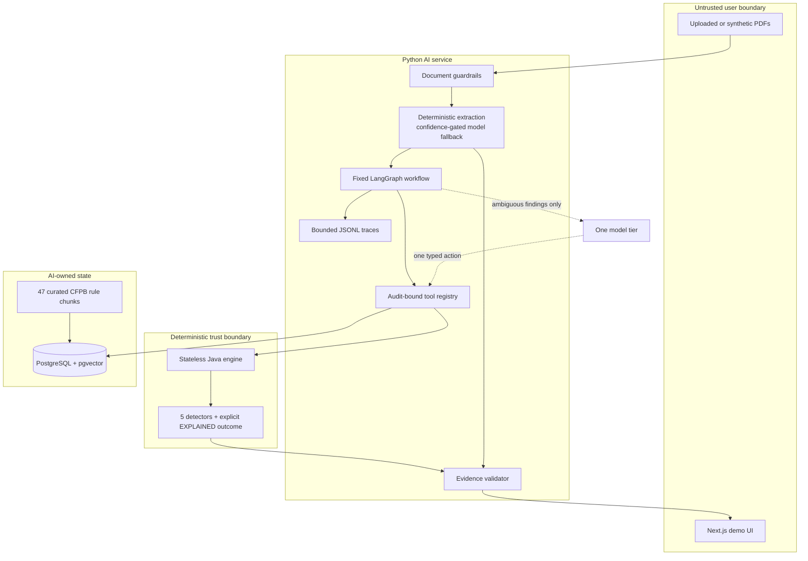

# Architecture and trust boundaries

ServicerSwitch is split by the kind of claim each component is allowed to make.
Deterministic code owns facts that can be calculated or compared; probabilistic code
is limited to understanding documents, retrieving context, and investigating an
already detected ambiguity. The split is enforced by process and schema boundaries,
not only by prompt wording.

## System view

## Why the engine is a separate stateless service

Mortgage reconciliation involves amortization, exact decimal money, escrow trial
balances, date windows, tolerances, and duplicate detection. None of those operations
benefits from a model. They need repeatability, boundary tests, and a small reviewable
surface.

The Java service therefore accepts one typed mortgage record through
`POST /reconcile` and returns a typed payment decomposition plus findings. It uses
`BigDecimal` and explicit half-up rounding. Its registry contains the five permitted
detectors and an explicit `EXPLAINED` outcome when a payment increase falls within
tolerance. It has no JPA, database driver, filesystem access, LLM client, or outbound
HTTP dependency. A dependency-boundary test protects that constraint.

Running the engine as a process boundary has three practical benefits:

1. The model cannot silently change arithmetic or tolerances through context.
2. The same request always produces the same response and evidence requirements.
3. Engine evaluation can exercise all 300 labeled records through the real HTTP
   contract, independently of extraction or provider availability.

The cost is an extra service boundary and DTO mapping. That cost is intentional: it
makes the most consequential calculations easy to test and difficult to bypass.

## The probabilistic boundary

The Python service owns tasks where document layout or ambiguity matters. Its graph
has seven fixed stages: load, classify, extract and validate, reconcile, investigate,
validate evidence, and assess risk/report. Only the investigation stage is agentic.
Document extraction itself has fixed control flow: a deterministic parser runs first,
and the model receives only missing or low-confidence fields.

The investigator receives one finding already emitted by the engine. On each turn it
may call one tool or propose one typed resolution. It is limited to 12 tool calls, 32
model turns, and a $0.25 preflight cost ceiling. Repeated successful calls are treated
as non-progress. Transport retries are bounded. When any budget, evidence, extraction,
or provider check fails, the finding remains and the audit requires human review.

A model statement that a finding is explained is insufficient. Suppression requires
an explicit structured deterministic result supporting the same condition. This is
why finding recall can remain high while autonomous task completion is lower.

## Tool-scoping model

Each audit gets a new registry containing exactly eight tools:

- `get_extracted_field`
- `get_escrow_ledger`
- `get_payment_history`
- `calculate_escrow_continuity`
- `calculate_payment_breakdown`
- `compare_tax_projection`
- `search_regulations`
- `mark_information_missing`

The public argument schemas never accept `audit_id`. The framework binds the trusted
identifier when it constructs the registry, and the dependency layer checks document
ownership again. The model has no arbitrary SQL, filesystem, URL-fetch, shell, or
calculator tool. Every response is capped at 8,000 characters with a visible
truncation marker. These properties are tested for happy paths, malformed arguments,
cross-audit attempts, and oversized results.

## Evidence contract

An AI-assisted claim is not displayable without `document_id`, one-based `page`,
`field`, and typed `value`. Deterministic extraction additionally records source text,
confidence, and a page bounding box. The web evidence viewer renders a page image
generated from the adjacent source PDF and overlays the cited coordinates. The
original PDF remains linked.

Deterministic/model disagreements retain both alternatives, cap confidence below the
review threshold, and cannot be silently resolved. The final evidence-validation
stage confirms that every cited document belongs to the audit and that an agent has
not introduced a finding absent from the deterministic result.

## Data and privacy lifecycle

PostgreSQL is owned by the AI service. It stores the curated regulation corpus and
supports hybrid vector plus full-text retrieval. The Java engine remains stateless.
Model trajectories are append-only JSONL under ignored `data/traces/`; arguments and
result summaries are bounded, and credentials are never logged.

The release demo seeds 47 previously measured C9 vectors from a checked-in artifact.
Startup therefore sends no corpus text to a provider and incurs no embedding charge.
The artifact is accepted only when every corpus ID appears exactly once and every
vector contains 512 finite values. Live re-embedding remains available through
`make ingest-kb` for deliberate evaluation runs.

The optional browser upload path keeps `File` objects only in the current page
session. It validates PDF type, count, and size, but performs no upload or persistence.
The UI labels the resulting measured synthetic view honestly instead of implying that
custom documents were reconciled.

## Untrusted-document controls

PDF text is data, never instruction. Before model access, guardrails reject empty or
image-only documents, wrong-account identifiers, conflicting values, implausible
dates, and out-of-range money. Model context uses collision-safe JSON wrappers rather
than instruction-like delimiters, and returned values are normalized and checked
again. The model receives no credentials or general-purpose tools.

The 20-document adversarial suite covers hidden text, tiny instructions, fake
authority, delimiter breakout, malicious tool JSON, contradictions, range attacks,
and cross-account contamination. It is a fixed synthetic benchmark, not a claim of
general prompt-injection immunity.

## Runtime and failure paths

Docker Compose starts PostgreSQL, engine, AI, and web services with dependency-aware
health checks. `make demo` waits for the database and engine, runs migrations and the
provider-free seed job, then starts the remaining services. The command returns only
after all four health checks pass.

Expected fail-closed paths include:

- low-confidence or conflicting extraction → preserve alternatives and require review;
- unknown, repeated, or failing tool call → log bounded error and continue or review;
- model cost/step exhaustion → preserve all remaining deterministic findings;
- missing or foreign evidence → reject the claim and require review;
- unavailable provider → keep deterministic results and surface review status.

This architecture does not address multi-tenant authorization, production object
storage, OCR, or production scaling. Those are explicit v1 exclusions rather than
hidden properties of the demo.
